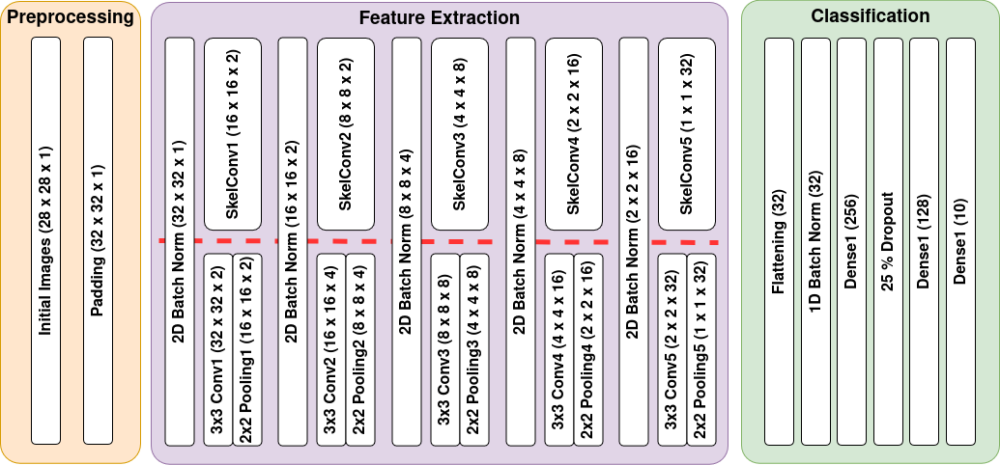

# Skeletal Convolution Experiments
This repository contains the code to reproduce experiments from Section 5.2 of the paper "Graph Lineages and Skeletal Graph Products", currently under review (arXiV link TBD).

## Usage

 python run_expt.py [SEED] [MODEL] [DATASET]

run_expt.py has several input parameters:
- SEED: random seed passed to numpy's random.seed and torch's random.manual_seed methods for reproducibility. Note that this will not affect the training/test split (which is set by the dataset cutators), but will affect how the training data is further split into training/validation.
- MODEL: which model to build. Either "CNN" or "SkelCNN".
- DATASET: Either 'MNIST' (MNIST digit recognition) or 'FMNIST' (Fashion MNIST clothing classification).

## Example
python run_expt.py 258 SkelCNN FMNIST

## Description of Contents

### build_models.py

Methods to build a torch.nn.Sequential object representing the following architectures:

The CNN vs SkelCNN keyword will determine which of the feature extraction subnetworks gets built. For details see the paper.

### constants.py

Constants such as batch size, number of epochs, loss function, activation function, etc.

### load_mnist.py

Adapted with thanks from https://mattpetersen.github.io/load-mnist-with-numpy

### requirements.yml

Versions of all packages used (for reproducibility).

### run_expt.py

Runs the experiment by training the chosen model on the chosen dataset for NUM_EPOCHS, logging accuracy and loss and saving the model which has done the best up to this point on the validation data.

### skel_models.py

Builds and runs the skeletal convolution feature extraction subnetwork.
